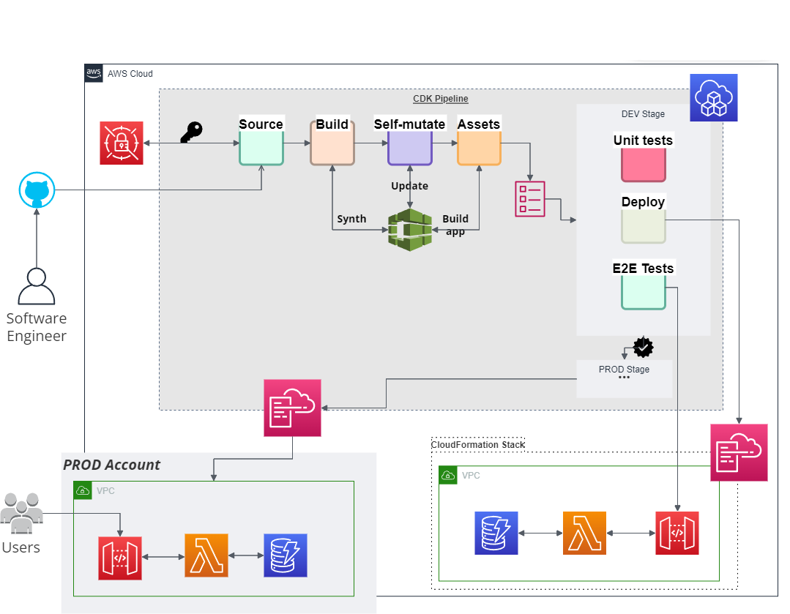
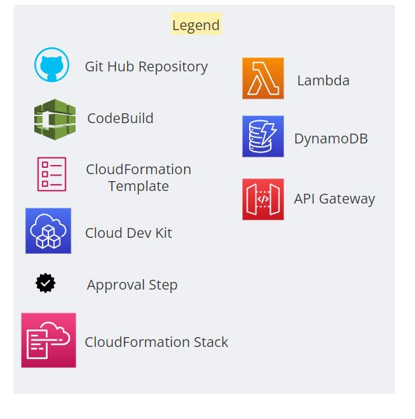

# CDK Pipeline Project

This project sets up a CI/CD pipeline using the AWS Cloud Development Kit (CDK) with AWS CodePipeline and related services. The pipeline automates the deployment of your application on AWS.

## Prerequisites

Before you begin, ensure you have the following installed:

- [AWS CLI](https://aws.amazon.com/cli/)
- [AWS CDK](https://aws.amazon.com/cdk/)
- [Python](https://www.python.org/) (>=3.6)

## Setup

1. **Clone the Repository:**

    ```bash
    git clone https://github.com/your-username/cdk-pipeline-project.git
    cd cdk-pipeline-project
    ```

2. **Install Dependencies:**

    ```bash
    pip install -r requirements.txt
    ```

3. **Configure AWS Credentials:**

    If you haven't configured AWS credentials, run:

    ```bash
    aws configure
    ```

4. **Bootstrap the AWS CDK Environment:**

    ```bash
    cdk bootstrap
    ```

## CDK Deployment

To deploy the CDK stack and set up the pipeline, run the following commands:

```bash
cdk deploy
```

## Architecture




## Legend




